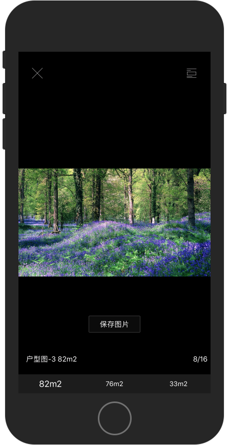

# PhotoViewDemo
A custom Album to show Images and thumbnails can be net image or local image.

###Why use the Album

If you need an album to show image groups and they need to show like a time line, then you can try this Album.
It's easy to use with the way of delegate. Block may hard to control the data you get from network with complicated structure. 
And if find some issues, please give me a notice.

###How to use the Album 

1. add delegate

```objc

@interface ViewController () <RexPhotoAlbumDelegate>

```
2. creat the album

```objc

    RexPhotoAlbum * vc = [[RexPhotoAlbum alloc] init];
    vc.delegate = self;
    [self presentViewController:vc animated:YES completion:nil];

```
3. ensure the delegate methods

```objc

- (NSInteger)numberOfSectionsInAlbum:(RexPhotoAlbum *)album {
        return self.imageStrArray.count;
}

- (NSInteger)photoAlbum:(RexPhotoAlbum *)album numberofItemsInSection:(NSInteger)section {
    return [self.imageStrArray[section] count];
}

- (NSString *)photoAlbum:(RexPhotoAlbum *)album titleForSection:(NSInteger)section {
    return self.sectionTitleArray[section];
}
...
- (NSString *)photoAlbum:(RexPhotoAlbum *)album imageNameForIndex:(NSIndexPath *)indexPath {
    return self.imageStrArray[indexPath.section][indexPath.row];
}
...

- (void)imageSavedToPhotosAlbum:(UIImage *)image didFinishSavingWithError:(NSError *)error contextInfo:(id)contextInfo {
    NSLog(@"保存成功");
}

```

###Previews





